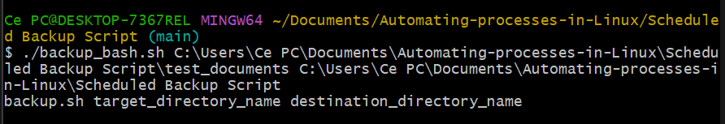

# Automating-processes-in-Linux

This repository contains 2 project done with bash scripting

### $${\color{lightblue} Automated \space Extract, Transform, Load (ETL) \space process}$$

---
This process scrap the data from [wttr.in](https://wttr.in/), here is their [GitHub Rep](https://github.com/chubin/wttr.in#readme).

The whole process is explaned in ETL_bash.sh script but here are some highlights:

- `curl wttr.in/casablanca` , I scraped the data form Casa only and you'll see that i stored them into raw_data  file then proceeded with the other operations. Why didn't i just as soon as a scraped, extracted the data i need? cause it's **good practice** to keep a copy of the data you're working with.
- In majority you'll see that i used the date or time stamp on  the file name:
     * You can ensure it’s name is unique.
     * Builds a history of the weather forecasts.
     * When you sort the files, they will be sorted chronologically.
     * Searching for the report for any given date.
- Of course the crontab commends are to be ran on a terminal window, i added them in the bash script only to show the whole process that i did.
- When schedulling always check your system hour with the UTC,i'm in **morocco**  (in gmt now) so you'll find that **i didn't take in hold the timezone difference since it's the same**.

### $${\color{lightblue} Scheduled \space Backup \space Script}$$
In this project we create a script called `backup_bash.sh` which runs every day and automatically backs up any encrypted password files that have been updated in the past 24 hours.

- You may be wondering why i added the first block in the script, it's because the user is human and the humans are faulty. Here i show a simple mistake where i used '\\'in place of '/'

- The `test_documents` are just documents i tested my bakcup script on, the output is the one ending in .gz
- The automating come with the `crontab` commend, where you specify the time for the scripet to be ran along with the directories.

